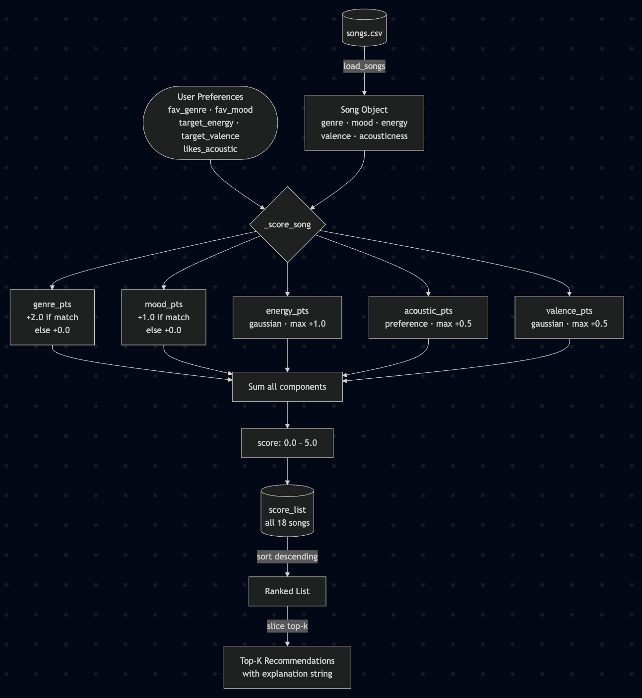
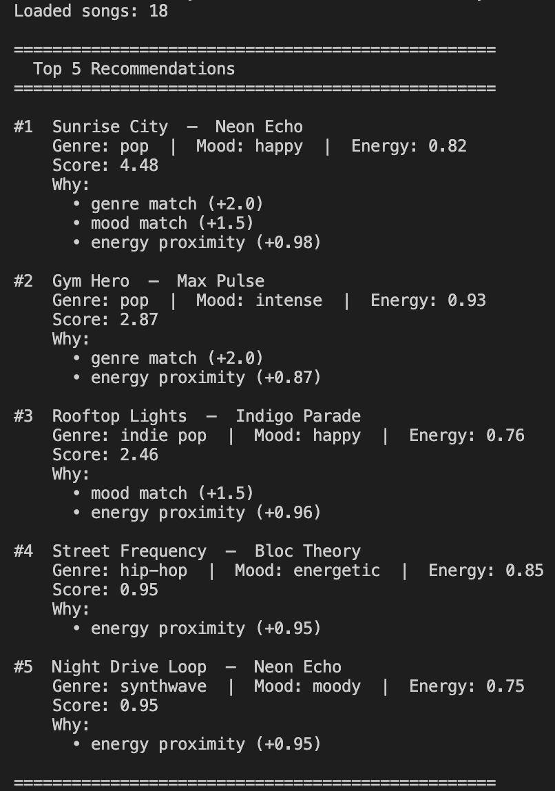
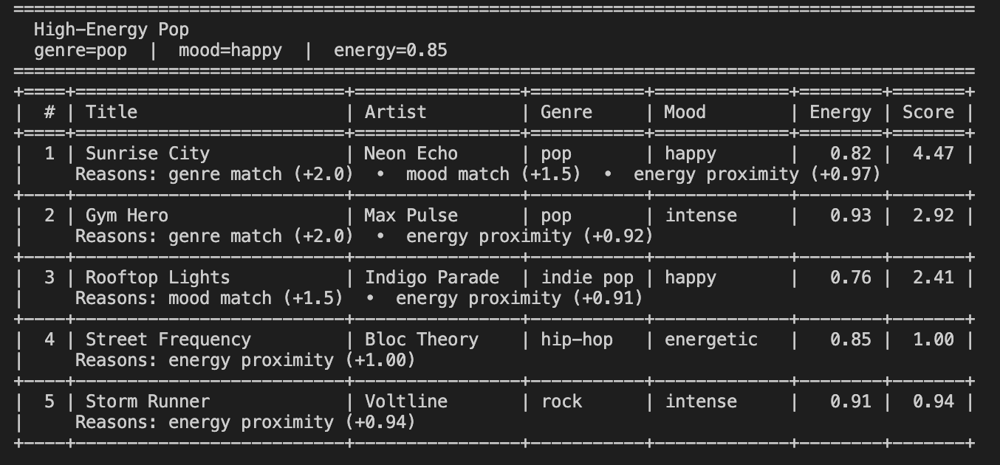
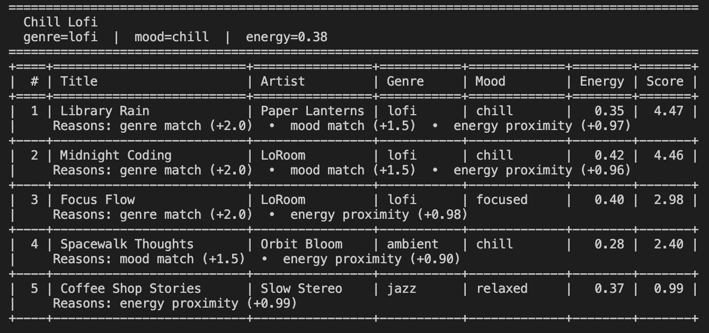
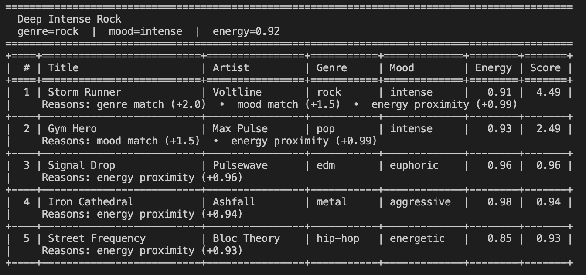
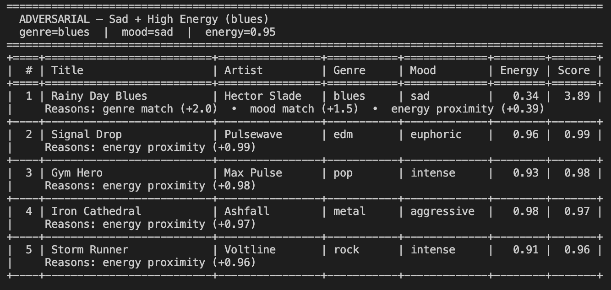
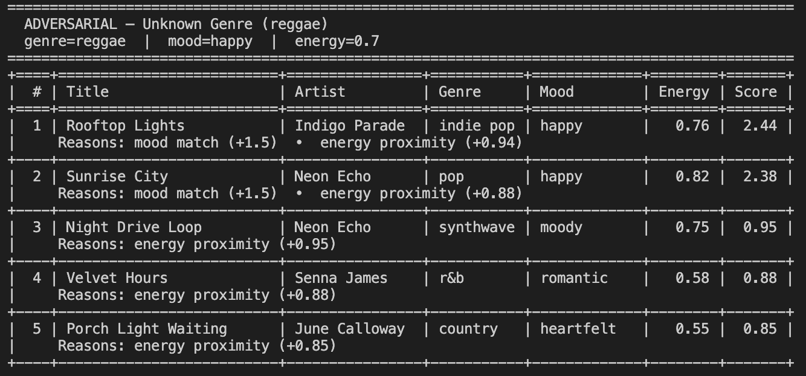
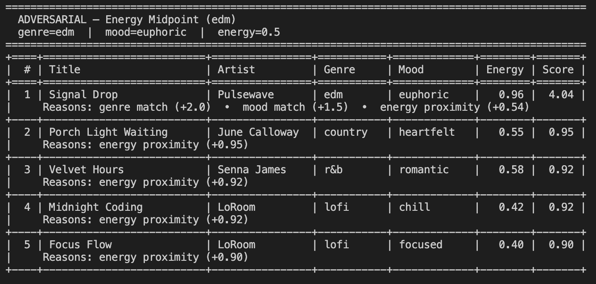
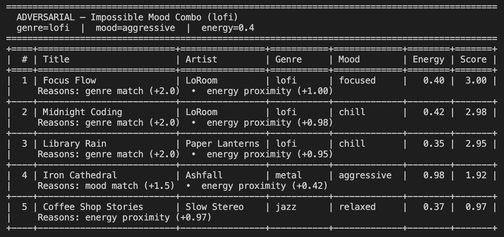
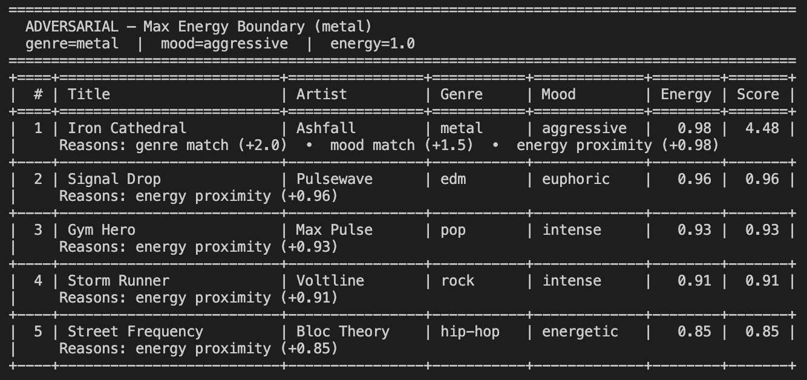

# 🎵 Music Recommender Simulation

## Project Summary

In this project you will build and explain a small music recommender system.

Your goal is to:

- Represent songs and a user "taste profile" as data
- Design a scoring rule that turns that data into recommendations
- Evaluate what your system gets right and wrong
- Reflect on how this mirrors real world AI recommenders

Replace this paragraph with your own summary of what your version does.

---

## How The System Works

### Approach

This simulation uses **content-based filtering** — no listening history, no other users. Each song in the catalog is scored independently against a user's taste profile, then the full list is sorted and the top-k results are returned.

```
songs.csv → score every song against UserProfile → sort by score → return top-k
```

### Algorithm Recipe

Each song receives points in up to five categories. Higher points = better match.

| Feature | Max pts | Rule |
|---|---|---|
| Genre match | +2.0 | +2.0 if `song.genre == user.favorite_genre`, else +0.0 |
| Mood match | +1.0 | +1.0 if `song.mood == user.favorite_mood`, else +0.0 |
| Energy proximity | +1.0 | Gaussian curve centered on `user.target_energy` (σ = 0.20) |
| Valence proximity | +0.5 | Gaussian curve centered on `user.target_valence` (σ = 0.20) |
| Acoustic fit | +0.5 | Rewards high acousticness if `likes_acoustic` is True, low if False |

**Max possible score: 5.0.** The Gaussian curve returns 1.0 at a perfect match and decays smoothly — a song 0.10 away still scores ~0.88×, a song 0.30 away scores ~0.14×.

**Why genre outweighs mood 2:1:** Genre encodes timbre, instrumentation, and production style — things you notice immediately. Mood is a softer label that often overlaps with energy and valence anyway, so it carries less independent information.

### Known Biases

- **Genre dominance.** A genre match is worth twice a mood match and twice the maximum energy score. A song that perfectly fits the user's mood, energy, and valence but has the wrong genre will almost always lose to a weaker same-genre song. Good cross-genre recommendations are largely invisible to this system.
- **Sparse catalog amplifies misses.** With only 18 songs and ~15 distinct genres, most user profiles will match at most 1–2 songs on genre. The top result is often determined by which song happens to share the genre, not which is the best overall fit.
- **Mood labels are coarse.** Two songs tagged "chill" can sound completely different (ambient vs. lofi). The system treats them as identical matches, which can produce results that feel off even when the score looks right.

---

## Getting Started

### Setup

1. Create a virtual environment (optional but recommended):

   ```bash
   python -m venv .venv
   source .venv/bin/activate      # Mac or Linux
   .venv\Scripts\activate         # Windows

2. Install dependencies

```bash
pip install -r requirements.txt
```

3. Run the app:

```bash
python -m src.main
```

### Running Tests

Run the starter tests with:

```bash
pytest
```

You can add more tests in `tests/test_recommender.py`.

---

## Experiments Tried

### System Overview

| | Image |
|---|---|
| **System flow diagram** — end-to-end architecture from `songs.csv` through the scoring formula to ranked output |  |
| **Initial terminal output** — recommendations produced by the default user profile on first run, before any profile variations were introduced |  |

---

### Profile Results

| Profile | Description | Screenshot |
|---|---|---|
| **High-Energy Pop** | Standard profile: `genre=pop`, `mood=happy`, `energy=0.85`. Ideal match is "Sunrise City". Genre weight dominates — top results cluster around pop songs with energetic, happy moods. |  |
| **Chill Lofi** | Standard profile: `genre=lofi`, `mood=chill`, `energy=0.38`. Ideal matches are "Library Rain" and "Midnight Coding". Low energy target surfaces the quietest lofi tracks in the catalog. |  |
| **Deep Intense Rock** | Standard profile: `genre=rock`, `mood=intense`, `energy=0.92`. Ideal match is "Storm Runner". High energy + intense mood produces a tight top-5 with little score spread between results. |  |
| **Adversarial — Sad + High Energy** | Conflicting mood vs. energy: `genre=blues`, `mood=sad`, `energy=0.95`. No catalog song is both sad and high-energy. Scoring splits — "Rainy Day Blues" wins on genre+mood (score ~3.94) despite its energy (0.34) being far from the 0.95 target. |  |
| **Adversarial — Unknown Genre** | `genre=reggae` never appears in the catalog, so the genre bonus can never fire. Max achievable score drops to 2.5. The recommender silently falls back to mood+energy ranking, which can feel off for a user who wanted reggae specifically. |  |
| **Adversarial — Energy Midpoint** | `genre=edm`, `mood=euphoric`, `energy=0.50`. No catalog song has exactly 0.50 energy, so the energy bonus is uniformly suppressed across all songs. Genre and mood dominate even more than usual, making energy nearly useless for tie-breaking. |  |
| **Adversarial — Impossible Mood Combo** | `genre=lofi`, `mood=aggressive`. Aggressive never appears in lofi songs, permanently locking out the +1.5 mood bonus. Every lofi song earns the same genre bonus; only energy separates the top results. |  |
| **Adversarial — Max Energy Boundary** | `genre=metal`, `mood=aggressive`, `energy=1.0`. At the boundary, the energy term collapses to the raw song energy value. Loud non-genre-match songs can outscore quieter genre matches, exposing a scoring vulnerability at the extreme. |  |

---

## Further Analysis

For a full breakdown of limitations, bias, evaluation findings, experiment log, future work, and personal reflection, see the [**Model Card**](model_card.md).

---

## Reflection

- Recommenders don't need to "understand" music to produce recommendations that look believable, they just need a scoring formula and a sorted list. That's both the power and the problem: the output always looks confident, even when the reasoning behind it has completely broken down (see: the reggae fallback returning synthwave with no warning).
- Bias here isn't a bug you can point to, it's structural. The genre bonus is worth twice the energy signal by design, which means a song with the wrong energy, wrong mood, and wrong feel will still outrank a near-perfect song from a different genre. That tradeoff felt reasonable when I set the weights; it felt less reasonable when I watched a country song land at #2 for an EDM user. The weights encode assumptions about what matters, and those assumptions are invisible unless you run adversarial cases on purpose.
